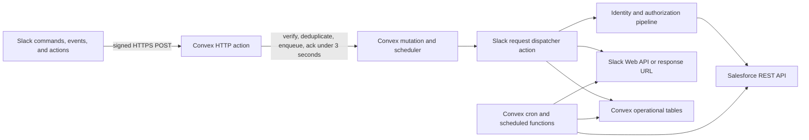

# Convex Migration Plan

- Status: dev migration complete; production cutover remains an explicit operator action
- Prepared: 2026-08-09
- Working branch: `codex/migration`
- Production branch: `master` remains untouched until the migration is reviewed and explicitly merged.

## Verified migration status (2026-08-10)

The code-level migration and dev rehearsal are complete on `codex/migration`.

- Convex development deployment: `successful-hornet-320`
- Slack delivery: signed HTTPS requests to `/slack/events`; Socket Mode is disabled
- Enterprise Grid scope: the configured Enterprise ID is retained as the canonical scope, with the verified installed workspace allow-listed for interactive deliveries
- Identity rehearsal: `namit@warpdrivetech.in` resolves through the existing Slack-to-Contact-to-distributor-account mapping
- Salesforce adapter: client-credentials transport is wired and account-scoped; reads and explicitly gated business writes are available in the dev deployment
- Primary-order rehearsal: dashboard navigation and product selection work; a no-match product search now explains the result and keeps the catalog visible
- Secondary-order polling: seed/reconcile code and tests are present; the production notification cron remains intentionally unregistered pending accepted evidence
- Legacy infrastructure: the authorized `dmsfa-server` Compute Engine instance in `us-central1-a` has been decommissioned after the dev rehearsal

This status does not authorize production Slack request-URL changes, a production Convex deployment, Salesforce Connected App changes, Slack app changes, or any remaining infrastructure action. Preserve the rollback path until the production acceptance evidence is recorded and the separate production cutover is approved.

## 1. Recommendation

Migrate the application to Convex, but treat it as a serverless refactor rather than a VM lift-and-shift.

The current product is small enough for the Convex Free plan at its present usage level. Convex can provide the public HTTPS endpoint, serverless functions, durable operational state, scheduled work, environment variables, and logs that currently require the GCP VM, pm2, ngrok, in-memory Maps, and process timers.

The migration is viable only after these two gates pass:

1. **Slack transport gate:** confirm the production app is using HTTP request delivery and can be pointed at Convex. The repository defaults and manifest enable Socket Mode, while `docs/deployment-ritual.md` documents the live VM with `SLACK_SOCKET_MODE=false` behind ngrok. If that deployment document is current, cutover is an HTTPS endpoint replacement; if production is actually using Socket Mode, it must switch to HTTP because Convex cannot run the long-lived WebSocket process used by `@slack/bolt` Socket Mode.
2. **Salesforce authentication gate:** the application must stop depending on `sf` CLI credentials stored on the VM. Convex has no local Salesforce CLI session or persistent home directory. An already-authorized server-to-server OAuth flow must work from a clean environment.

The preferred Salesforce flow is OAuth client credentials against the org's My Domain URL, using the existing integration user. `SalesforceAuth` already contains the token exchange and the environment schema admits `CLIENT_CREDENTIALS`, but `initSalesforceClient()` currently does not wire that mode into a usable client. Wiring and testing that path is part of the migration. If the current Salesforce app is not already configured for it, that is a migration blocker under the repository's **no Salesforce-side changes** constraint until a Salesforce administrator explicitly approves the required configuration. Do not quietly fall back to the username-password flow as the permanent design.

Convex should hold only operational state. Salesforce remains the source of truth for distributors, orders, GRNs, returns, claims, invoices, dispatches, inventory, and ARS data.

## 2. Why this is not a direct deployment

The existing entry point, `src/server.ts`, assumes a continuously running Node.js process:

- it starts a raw health-check HTTP listener;
- it starts a Bolt Socket Mode or HTTP listener;
- it initializes a process-local Salesforce client;
- it starts a one-minute partial-order reminder loop;
- it starts a five-minute secondary-order polling loop;
- it handles `SIGTERM` and `SIGINT` for graceful shutdown.

Convex does not host that process model. The target must instead be event-driven:



The HTTP ingress must acknowledge Slack within three seconds. It should verify the request, normalize and deduplicate it, durably schedule processing, and return HTTP 200. Salesforce reads/writes and most Slack responses then run asynchronously.

## 3. Current-to-target mapping

| Current implementation | Current dependency | Convex target | Migration treatment |
|---|---|---|---|
| `src/server.ts` raw health server | Always-on Node process and port 3000 | `GET /health` HTTP action | Replace; report deployment/build identity and last integration status instead of process uptime |
| Bolt Socket Mode | Long-lived WebSocket and `SLACK_APP_TOKEN` | Signed Slack HTTP requests at a `.convex.site` route | Replace and disable Socket Mode only at production cutover |
| Bolt HTTP receiver on port 3001 | VM listener plus ngrok | `POST /slack/events` HTTP action | Replace ngrok and the VM listener |
| `app.command`, `app.event`, and 50 registered action handlers in the active router | Bolt listener registration and callback context | Transport-neutral dispatcher keyed by request type, action ID, and regex patterns | Extract handler logic; reuse existing block builders and services |
| Bolt `respond()` | Bolt callback wrapper | Direct `fetch` to Slack `response_url` | Add a small Slack gateway abstraction |
| `app.client.chat.*`, `views.publish`, `users.info` | Bolt Web API client | Direct Slack Web API client using `fetch` and `SLACK_BOT_TOKEN` | Replace client dependency without changing product behavior |
| `idempotencyStore.ts` Map | Process memory and hourly cleanup timer | `idempotencyKeys` table plus atomic acquire/complete/fail mutations | Replace; retain 24-hour semantics and add expiry index |
| `slackStateStore.ts` Map | Process memory and five-minute cleanup timer | `interactionStates` table | Replace; read only unexpired records and clean in batches |
| `orderBuilders` Map | Module memory | `orderBuilders` table keyed by team and user | Replace; preserve selected products, quote, and credit-note state |
| `pendingARSChanges` Map | Module memory | `pendingArsChanges` table keyed by message timestamp | Replace; retain approver context and terminal state |
| Slack identity cache Map | Instance memory | `slackIdentityCache` table or no cache initially | Add only if measured latency/Slack API traffic justifies it |
| App Home rate-limit Map | Instance memory | `appHomePublishes` table with atomic last-published check | Replace; retain five-second suppression |
| `PartialOrderReminderService` Map and interval | Always-on process | Durable reminder record plus one scheduled send per due reminder | Replace; reschedule only while the reminder remains active |
| `SecondaryOrderPoller` interval and `lastSeen` Map | Always-on process | Five-minute cron plus durable watermark/notification keys | Replace; seed the watermark before enabling notifications |
| Salesforce CLI authentication | `sf` binary and `/root/.sfdx` | OAuth client credentials, preferably in the Convex runtime | Wire the partially implemented mode into the client factory; keep CLI auth only in the legacy VM adapter during transition |
| Pino process logging | Node stream/runtime assumptions | Structured `console` logging and sanitized operational-status records | Add a logger interface; do not persist secrets or raw payloads |
| pm2, GCP firewall, and ngrok | GCP VM operations | Convex deployment and dashboard | Retire only after acceptance and rollback window |

## 4. Target code structure

Use an incremental adapter design so existing business logic remains testable while the old VM still runs:

```text
convex/
  convex.config.ts          typed environment contract
  schema.ts                 operational tables and indexes
  http.ts                   /slack/events and /health routes
  slackIngress.ts           signature verification, parsing, dedupe, enqueue
  slackDispatch.ts          command/event/action dispatch
  slackApi.ts               response_url and Slack Web API fetch helpers
  operationalState.ts       state and idempotency mutations/queries
  reminders.ts              reminder scheduling and delivery
  secondaryOrderPoller.ts   scheduled Salesforce reconciliation
  crons.ts                  recurring schedules and retention cleanup
  integrationStatus.ts      sanitized health and last-success state

src/
  core/                     transport-neutral handlers and domain orchestration
  slack/blocks/             existing Block Kit builders, largely unchanged
  salesforce/               REST client and auth provider interfaces
  legacy/                   VM/Bolt adapter retained only until cutover
```

This is a direction, not a requirement to move every existing file on day one. The first implementation step should create narrow interfaces around Slack delivery, state, idempotency, logging, clock/scheduling, and Salesforce authentication. Handlers can then move behind those interfaces in small batches.

Do not attempt to make a fake Bolt `App` run inside an HTTP action. That would preserve the wrong lifecycle and make cold-start, acknowledgement, and request-signature behavior harder to reason about. Keep `@slack/bolt` only for the temporary legacy adapter, then remove it after cutover.

## 5. Slack HTTP ingress design

### 5.1 One route, three payload families

Configure the Slack app's slash command, Event Subscriptions, and Interactivity request URLs to the same production route:

```text
https://<production-deployment>.convex.site/slack/events
```

The route must handle:

- URL verification challenges;
- slash-command form payloads;
- `application/x-www-form-urlencoded` interactive payloads containing JSON in the `payload` field;
- Events API JSON payloads such as `app_home_opened`.

The repository command is standardized on `/dms` across `manifest.json`, `slack-manifest.yaml`, runtime configuration, tests, and operator documentation. Confirm the installed Slack command is `/dms` during manual cutover before changing request URLs.

### 5.2 Request security

Before parsing business data:

1. Read and retain the exact raw request body.
2. Reject a missing or stale `X-Slack-Request-Timestamp`; allow at most five minutes of skew.
3. Compute the Slack `v0` HMAC SHA-256 signature using `SLACK_SIGNING_SECRET`.
4. Compare the calculated and supplied signatures without a timing-sensitive comparison.
5. Enforce the expected Slack team/workspace ID because this is a single-workspace app.
6. Reject unsupported content types and payload types.

Never log the raw request body, signing secret, bot token, Salesforce credential, or Slack `response_url`.

### 5.3 Acknowledge first, process second

The ingress path must not wait for Salesforce or dashboard rendering:

1. Verify and parse the request.
2. Handle `url_verification` synchronously.
3. Derive a dedupe key:
   - Events API: Slack `event_id`;
   - retries: stable hash of Slack timestamp plus the raw body;
   - interactive actions/commands: stable hash of request timestamp, team, user, trigger/action identity, and raw body.
4. Run one internal mutation that atomically records the receipt and schedules an internal action.
5. Return HTTP 200 within the Slack three-second window.

Slack retries failed Events API deliveries. Duplicate delivery handling is therefore part of correctness, not an optional optimization.

Convex scheduled actions execute at most once and are not automatically retried. The processing action must catch failures and write a terminal or retryable state. A low-frequency reconciliation job should reschedule stale retryable receipts with bounded backoff. Never automatically retry a Salesforce create/update after an ambiguous network result; first reconcile against Salesforce using a deterministic business/idempotency reference, or leave the record for explicit operator review.

Most existing interactions already answer through `respond()` or the Slack Web API and do not open a modal with `views.open`. They are compatible with asynchronous processing. If a future flow uses a `trigger_id` to open a true modal, implement a separately tested fast path because trigger IDs also expire in roughly three seconds.

### 5.4 Minimize retained Slack payload data

Store a normalized envelope, not an indefinite copy of the raw webhook:

- request/dedupe ID;
- kind, team ID, user ID, and action/event identifier;
- only the fields needed by the selected handler;
- processing status, attempts, timestamps, and sanitized error code;
- `response_url` only when needed, with a short expiry, and scrub it after terminal completion.

Keep ingress records for a short operational window, initially seven days. Keep sanitized audit records for 30 days unless the product owner approves a different retention requirement.

## 6. Convex data model

The initial schema should be deliberately small and indexed by every scheduled lookup:

### `slackIngress`

- `dedupeKey`
- `kind`: `command | event | action`
- `teamId`, `userId`
- `handlerKey`
- normalized payload required for processing
- optional short-lived `responseUrl`
- `status`: `accepted | processing | completed | failed`
- `attemptCount`, `receivedAt`, `updatedAt`, `expiresAt`
- indexes: `by_dedupe_key`, `by_status_updated_at`, `by_expires_at`

### `idempotencyKeys`

- `key`
- `status`: `processing | completed | failed`
- sanitized result reference or summary, not arbitrary large Salesforce responses
- `createdAt`, `updatedAt`, `expiresAt`
- indexes: `by_key`, `by_expires_at`

Acquisition must be a single mutation. Two concurrent requests must not both observe `new` and perform the same Salesforce write.

### `interactionStates`

- `key`, `teamId`, `userId`, `channelId`
- typed flow kind and state payload
- `createdAt`, `updatedAt`, `expiresAt`
- indexes: `by_key`, `by_user_flow`, `by_expires_at`

### `orderBuilders`

- `teamId`, `userId`
- selected products, quote, and selected credit-note IDs
- `updatedAt`, `expiresAt`
- index: `by_team_user`

### `pendingArsChanges`

- Slack message/channel identifiers
- requesting user and resolved Salesforce account
- proposed changes
- `status`: `pending | approved | rejected | expired`
- `createdAt`, `resolvedAt`, `expiresAt`
- indexes: `by_message_ts`, `by_status`

### `partialOrderReminders`

- Salesforce order/account identifiers
- Slack user ID
- display fields required for the notification
- pending item count
- `active`, `nextReminderAt`, `lastSentAt`, `attemptCount`
- indexes: `by_order_id`, `by_active_next_reminder`

### `secondaryOrderWatermarks`

- Salesforce account/user scope
- last successful poll time and deterministic order watermark
- last failure code/time
- index: `by_account`

### `slackIdentityCache` (optional after measurement)

- team/user key
- email, display name, enterprise ID
- `fetchedAt`, `expiresAt`
- index: `by_team_user`

Email is personal data. If this cache is added, keep the five-minute TTL and daily cleanup rather than turning it into a user directory.

### `integrationStatus`

- component name
- last attempt/success/failure timestamps
- consecutive failure count
- sanitized status/error code
- index: `by_component`

This table powers health checks without exposing tokens, Salesforce URLs containing secrets, raw error bodies, or user records.

## 7. Salesforce integration changes

### 7.1 Authentication gate

Run a clean-environment spike before migrating Slack handlers:

1. Wire `CLIENT_CREDENTIALS` through the Salesforce client factory with explicit validation of its required variables.
2. From a machine or isolated process with no usable `sf` CLI session, set only the intended server-to-server OAuth variables and authenticate through that path.
3. Use the Salesforce org's My Domain URL, not `login.salesforce.com`, for client credentials.
4. Run one read-only identity query and one representative read from each major service family.
5. Confirm that outbound Convex IP allowlisting is not required by Salesforce session/IP policies. If it is required, review the official Convex regional egress range with the Salesforce administrator. IP source alone must not be treated as authentication.
6. Keep `ALLOW_SAFE_SALESFORCE_TEST_WRITES=false` and `ALLOW_LIVE_BUSINESS_WRITES_FROM_SLACK=false` during this gate.

Pass condition: the integration user can authenticate and all required existing object/API reads succeed without any Salesforce metadata change.

If client credentials are not already enabled, stop and document the exact missing Salesforce setting. Do not bypass the repository constraint by creating or editing a Connected App without approval.

### 7.2 Runtime refactor

- Make Salesforce configuration explicit constructor input instead of importing VM-oriented global configuration.
- Keep the existing `ISalesforceClient` boundary.
- Add the missing `CLIENT_CREDENTIALS` branch to the client factory and tests; the token method alone is not an end-to-end runtime path.
- Separate `SalesforceCliAuth` so it is never imported into the Convex bundle.
- Prefer the Convex JavaScript runtime for fetch-only Salesforce calls to reduce cold starts and action compute. Use a Node action only if a verified dependency requires Node APIs.
- Treat module-level access-token caching as an optimization only; it cannot be required for correctness in a serverless runtime.
- Continue automatic reauthentication after HTTP 401.
- Preserve every existing `salesforceAccountId` scope check and the rule that account IDs never come from Slack user input.
- Preserve `BlockedBySalesforceCapabilityError` behavior for known Salesforce gaps.

Do not copy Salesforce business records into Convex merely to make screens faster. Add caching only after measuring a real latency or quota problem, with an explicit staleness and authorization design.

## 8. Scheduler migration

### 8.1 Secondary-order polling

Replace the five-minute process interval with a Convex cron that invokes one internal action. The action should:

1. load the configured polling identities/scopes;
2. resolve each account through the existing identity rules;
3. query secondary orders from Salesforce;
4. compare them with a durable account watermark and per-order notification key;
5. post each new notification once;
6. update the watermark/status through a mutation only after the relevant outcome is known.

Before enabling production notifications, seed the watermark with the current Salesforce result set while notification delivery is disabled. Otherwise every currently visible order could be announced as new after the migration.

Do not keep the current `LIVE_TEST_EMAIL`-only behavior hidden in production. Define the supported polling audience explicitly. If only one test identity is intended, say so in configuration and health diagnostics.

### 8.2 Partial-order reminders

Do not reproduce the one-minute full-table timer. When a partial order is registered:

1. upsert a reminder record;
2. schedule a function for its exact `nextReminderAt`;
3. at execution, reload the record and exit if inactive or superseded;
4. send the Slack notification;
5. update the attempt/result and schedule the next occurrence only if still active.

Use a low-frequency reconciliation cron as a safety net for overdue active reminders. Deregistration must make already-scheduled functions harmless.

### 8.3 Retention cleanup

Use one daily batched cleanup for expired ingress, state, identity-cache, idempotency, and terminal reminder documents. Avoid a separate frequent cron per table. Queries must always apply `expiresAt` logically even if physical cleanup is delayed.

## 9. Free-tier capacity and operational policy

The limits below were verified against official Convex documentation and pricing on 2026-08-09. They are team-wide, can change, and must be checked again immediately before production cutover.

| Resource | Current Free-plan allowance | Initial policy for this app |
|---|---:|---|
| Function calls | 1,000,000/month | Alert/review at 50%, 75%, and 90%; include HTTP actions, scheduled executions, mutations, and queries in the estimate |
| Action compute | 20 GB-hours/month | Prefer the 64 MiB Convex runtime and fetch-only clients; investigate any action routinely taking more than a few seconds |
| Database storage | 0.5 GB total | Keep only operational state; enforce retention and avoid Salesforce record replication |
| Database I/O | 1 GB/month | Use indexed lookups; never scan the ingress/audit tables from a hot path |
| Data egress | 1 GB/month | Track Salesforce and Slack response sizes; avoid large report payloads and file proxying |
| File storage | 1 GB total | Out of scope for this migration; do not route Slack files through Convex yet |
| S16 concurrency | 64 HTTP/Convex actions, 64 Node actions, 8 scheduled jobs | Adequate for the current single-workspace, low-volume app; verify queue lag during rehearsal |

The existing five-minute poll alone is about 8,640 cron invocations in a 30-day month. Even after the surrounding reads and writes are counted, it is far below one million calls at current scale. Action compute and egress are more important unknowns because each poll calls Salesforce; measure them in the dev deployment before calling the free-tier fit proven.

Free is a hard-capped prototype/personal-project plan. When a resource cap is exceeded for long enough, function calls can return HTTP errors. Service SLAs are listed only for higher business tiers. Therefore:

- treat this as a cost-saving pilot deployment, not a guaranteed business-critical hosting tier;
- review the Convex usage dashboard weekly and daily during the first week;
- retain a documented upgrade/alternate-host trigger;
- move to Starter or another host before sustained usage reaches 75% of any hard cap;
- do not promise uninterrupted service based on the Free plan.

Suggested trigger: if two consecutive weekly projections exceed 75% of calls, compute, database I/O, or egress, prepare the paid/alternate-host decision rather than waiting for failures.

## 10. Implementation phases

### Phase 0 - Preconditions and spike

Estimated active effort: 4-6 hours.

- Confirm `codex/migration` is based on the intended production commit and keep `master` untouched.
- Confirm the installed `/dms` command matches the standardized manifest and runtime configuration.
- Reconcile documented/runtime configuration drift before copying settings: Slack transport mode and Salesforce API version must come from the verified live configuration, not defaults in source or stale documentation.
- Create Convex dev and production deployments in US East unless a data-residency requirement selects another supported region.
- Declare typed environment variables, but populate secrets separately per deployment.
- Prove client-credentials Salesforce authentication with no `sf` CLI session.
- Prove a Convex HTTP action can receive a signed Slack test request and return within three seconds.
- Record current GCP trial end date and choose a cutover date with at least a 72-hour rollback window before it.

Exit criteria: both migration gates pass, or the plan is explicitly marked blocked with the exact administrator action required.

### Phase 1 - Serverless foundation

Estimated active effort: 6-10 hours.

- Add the Convex package/configuration and separate Convex TypeScript configuration from the legacy CommonJS build.
- Add `schema.ts`, `/health`, typed environment validation, and a sanitized logger/status abstraction.
- Introduce interfaces for Slack API delivery, state, idempotency, clock/scheduler, and Salesforce auth.
- Keep the current Bolt/Map implementations as legacy adapters so existing tests still pass.

Exit criteria: Convex dev deploy succeeds, `/health` is public and safe, and the existing application still passes its tests unchanged through legacy adapters.

### Phase 2 - Durable state and idempotency

Estimated active effort: 8-12 hours.

- Implement Convex tables/indexes and atomic idempotency mutations.
- Move order-builder and pending-ARS state behind repositories.
- Implement expiry-aware reads and daily batched cleanup.
- Add concurrency tests proving only one Salesforce write is authorized per idempotency key.

Exit criteria: interaction state survives function/process boundaries; concurrent duplicate tests pass; no handler imports a global Map directly.

### Phase 3 - Slack ingress and handler extraction

Estimated active effort: 18-26 hours.

- Implement raw-body signature verification using Slack's published algorithm and test vector.
- Implement payload parsing, URL verification, retry/dedupe behavior, and asynchronous scheduling.
- Build the transport-neutral dispatcher for command, event, exact action IDs, and regex action IDs.
- Extract handlers from the 1,300-line `router.ts` in functional groups: dashboard/navigation, primary order, GRN, returns/claims, secondary orders/invoicing/dispatch, inventory, ARS, and diagnostics.
- Implement direct Slack `fetch` helpers for `users.info`, `chat.postMessage`, `views.publish`, and `response_url`.
- Replace the current one-second in-handler polling loop after dispatch delivery with scheduled follow-up checks, so an action does not sit idle while consuming execution time.
- Reuse the current Block Kit builders.

Exit criteria: the sandbox Slack app exercises every registered route family against the Convex dev deployment, signature failures are rejected, duplicates do not repeat side effects, and acknowledgements remain under three seconds.

### Phase 4 - Scheduled services

Estimated active effort: 6-10 hours.

- Replace partial reminder intervals with durable scheduled functions and reconciliation.
- Replace secondary-order polling with a five-minute cron, watermarking, and notification idempotency.
- Seed production watermarks with notifications disabled.
- Add failure counters and last-success state used by `/health`.

Exit criteria: restart/process loss is no longer relevant; reminder and poller tests pass across separate function executions; seeded orders are not announced as new.

### Phase 5 - Verification and production rehearsal

Estimated active effort: 10-16 hours plus administrator coordination.

- Run the full automated matrix in Section 11.
- Deploy to a separate sandbox Slack app or temporary sandbox command so the production app remains on the VM.
- Run read-only live Salesforce rehearsal first.
- Run explicitly authorized safe-write cases with uniquely identifiable test records.
- Observe function calls, action compute, egress, latency, scheduled-job lag, and error rate for at least 24 hours.
- Recheck current Convex limits and Salesforce/Slack configuration immediately before approving cutover.

Exit criteria: evidence is captured for every critical flow, no authorization scope regression is found, and projected monthly usage stays below 50% of each Free-plan cap at rehearsal traffic plus an agreed growth factor.

### Phase 6 - Cutover and GCP retirement

Estimated active effort: 4-8 hours spread across the rollback window.

- Announce a short no-write window and allow active Slack flows to finish or expire.
- Reconcile any currently active partial-order reminders; rebuild them from Salesforce if possible. If they cannot be reconstructed, record the exact reminders that will reset and obtain business sign-off.
- Confirm secondary-order watermarks are seeded and notification cron remains disabled.
- Deploy the reviewed production commit to Convex and verify `/health`.
- Update Slack command, events, and interactivity URLs to the Convex route.
- Disable Socket Mode, if it remains enabled for request delivery, only when the HTTP URL verification and signed request checks pass.
- Enable scheduled notifications after inbound flows are healthy.
- Run the production smoke matrix and monitor closely.
- Preserve the VM as rollback capacity only within the pre-funded window; do not allow an unplanned paid GCP resource to continue after credits expire.
- After acceptance, export needed logs/configuration, revoke/remove obsolete VM-only secrets, stop ngrok and pm2, remove the Salesforce CLI refresh cron, and decommission the GCP VM through a separately approved infrastructure action.

Exit criteria: production Slack traffic is served only by Convex, scheduled work is healthy, rollback is no longer required, and GCP billing exposure is removed.

### Total estimate

- **Active implementation and verification:** approximately 56-88 hours.
- **Calendar time for one developer with Codex assistance:** approximately 8-14 working days.
- **External coordination:** add time for Slack administration, Salesforce authentication approval, and the 24-hour rehearsal/72-hour rollback window.

This estimate includes the full set of current Slack route families, not merely a hello-world webhook. The largest uncertainty is the handler extraction from `router.ts` and the Salesforce OAuth gate.

## 11. Verification matrix

### Repository checks

Follow the repository order for every implementation commit:

```bash
npm run lint
npm run typecheck
npm test
```

Add the appropriate Convex code-generation/deployment validation before production. Run `npm run build` only when validating the retained VM build or the final removal of that path, consistent with repository guidance.

### Unit tests

- Slack signature validation with the official known test vector.
- stale timestamp, missing signature, malformed body, unsupported team, and timing-safe mismatch cases.
- slash-command, Events API, interactive-action, and URL-challenge parsing.
- exact and regex action dispatch parity with the current registrations.
- atomic idempotency acquisition under concurrent calls.
- expired interaction state and terminal-state behavior.
- Salesforce account scoping and rejection of user-supplied account IDs.
- reminder rescheduling, deregistration, retry, and overdue reconciliation.
- secondary-order watermark seeding, duplicate suppression, and failed-send retry semantics.
- sanitized health/log output contains no credentials or `response_url`.

### Integration tests in Convex dev

- signed HTTP request returns 200 within three seconds and schedules exactly one job.
- repeated Slack retry headers/body do not repeat Salesforce or Slack side effects.
- scheduled action can read state written by ingress and post through a fake Slack endpoint.
- Salesforce authentication retries once after 401 and does not retry non-idempotent writes blindly.
- state remains available across separate function invocations.
- cron history, scheduler lag, and last-success status are observable.

### Slack sandbox acceptance

- installed slash command renders the dashboard;
- App Home publishes and rate limiting works;
- every top-level menu opens;
- representative reads work for primary orders, secondary orders, inventory, invoices, returns/claims, ARS, insights, and diagnostics;
- authorized create/update flows work once and duplicate button presses do not duplicate records;
- errors remain user-safe;
- approval messages and thread replies target the correct channel/user;
- app behavior after several idle minutes confirms no dependency on a warm process.

### Live Salesforce acceptance

Start with writes disabled. Verify identity resolution, active distributor authorization, data scoping, and representative reads. Enable test writes only with explicit approval and uniquely labeled records that can be identified afterward. Do not modify Salesforce metadata as part of this migration.

## 12. Cutover and rollback runbook

### Cutover checkpoints

1. Convex production deploy matches the reviewed commit.
2. Required production environment variables exist; no values are printed into logs or a committed file.
3. `/health` shows healthy Slack/Salesforce configuration without exposing secret values.
4. Slack URL verification succeeds.
5. Secondary-order watermark is seeded; notification cron is still off.
6. No active write flow is in progress on the VM.
7. Slack request URLs switch to Convex and Socket Mode is disabled if it was active for delivery.
8. Command, App Home, one read flow, and one idempotent test action pass.
9. Scheduled jobs are enabled and monitored.

### Rollback triggers

Rollback immediately if any of these occur and cannot be corrected within the maintenance window:

- invalid Slack signature failures for genuine requests;
- repeated acknowledgement times over three seconds;
- Salesforce authentication failure across two clean retries;
- any cross-account data exposure or missing `salesforceAccountId` scoping;
- duplicate Salesforce writes;
- scheduler backlog causing missed operational notifications;
- unexpected Free-plan usage trajectory;
- sustained error rate above the agreed acceptance threshold.

### Rollback action

1. Disable Convex notification crons.
2. Stop accepting new work at the Convex route or leave it returning a controlled maintenance response.
3. Re-enable Slack Socket Mode and restart the known-good VM in Socket Mode, or restore the previous verified HTTP/ngrok request URLs if that is the tested rollback path.
4. Confirm only one runtime consumes production Slack events.
5. Re-run command, App Home, and identity-resolution smoke tests.
6. Reconcile Convex ingress/idempotency records with Salesforce writes before attempting another cutover.

Never run the VM Socket Mode consumer and the Convex production HTTP consumer as independent active processors for the same Slack app without an explicit duplicate-delivery design.

## 13. Scope boundaries

Included:

- replacement of VM, pm2, ngrok, process listeners, process timers, and process-local operational state;
- Slack command, App Home, actions, Slack responses, reminders, and secondary-order polling;
- migration from VM-local Salesforce CLI authentication to an existing supported server-to-server OAuth path;
- dev/prod deployment, verification, cutover, rollback, and GCP retirement plan.

Not included unless separately approved:

- Salesforce metadata, object, Apex, sharing-rule, or Connected App changes;
- redesigning blocked Salesforce capabilities;
- copying Salesforce business data into Convex;
- new web frontend;
- Slack file-storage implementation;
- multi-workspace tenancy;
- paid Convex features, custom domains, or an SLA;
- automatic GCP resource deletion as part of application code changes.

## 14. Definition of done

The migration is complete only when:

- `master` was not edited directly; reviewed changes arrived through the dedicated branch workflow;
- the application has no production dependency on a VM, pm2, ngrok, an open port, Socket Mode, a local filesystem, or Salesforce CLI state;
- all current registered Slack route families have a mapped and tested HTTP dispatcher path;
- Slack requests are authenticated and acknowledged within three seconds;
- duplicate Slack deliveries and duplicate button presses cannot repeat Salesforce writes;
- operational state, reminders, and watermarks survive cold starts;
- app-enforced account scoping remains intact;
- Salesforce remains the business system of record and no prohibited Salesforce-side changes were made;
- production health, logs, scheduler status, and Free-plan usage are observable;
- cutover and rollback were both rehearsed before the GCP VM is removed;
- the GCP VM and obsolete secrets/tunnels/cron jobs are retired through an explicitly approved infrastructure step.

## 15. Official references

- [Convex HTTP Actions](https://docs.convex.dev/functions/http-actions)
- [Convex Actions and runtimes](https://docs.convex.dev/functions/actions)
- [Convex scheduling overview](https://docs.convex.dev/scheduling/overview)
- [Convex cron jobs](https://docs.convex.dev/scheduling/cron-jobs)
- [Convex scheduler execution guarantees](https://docs.convex.dev/api/interfaces/server.Scheduler)
- [Convex limits](https://docs.convex.dev/production/state/limits)
- [Convex pricing](https://www.convex.dev/pricing)
- [Convex environment variables](https://docs.convex.dev/production/environment-variables)
- [Convex networking and outbound IPs](https://docs.convex.dev/production/networking)
- [Slack request verification](https://docs.slack.dev/authentication/verifying-requests-from-slack/)
- [Slack interaction acknowledgement](https://api.slack.com/interactivity/handling)
- [Slack Events API delivery and retries](https://api.slack.com/apis/connections/events-api)
- [Salesforce OAuth client credentials configuration](https://help.salesforce.com/s/articleView?id=xcloud.connected_app_client_credentials_setup.htm&language=en_US&type=5)
